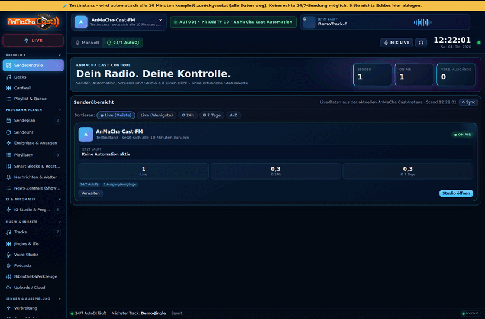
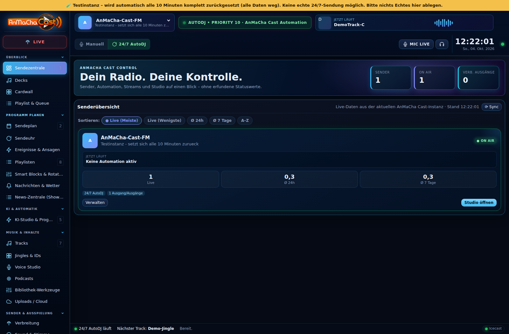
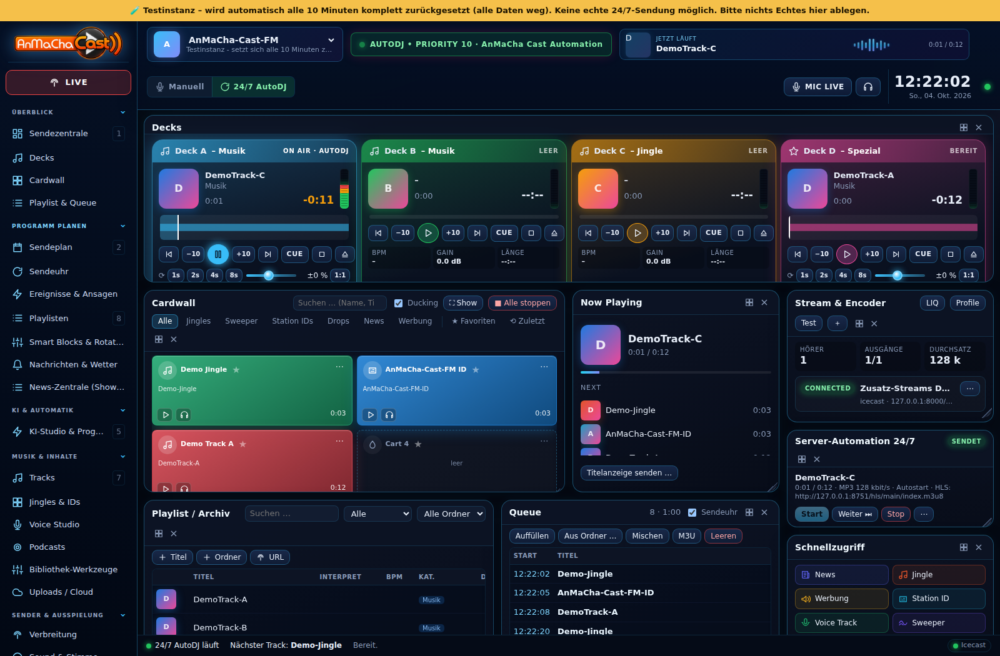
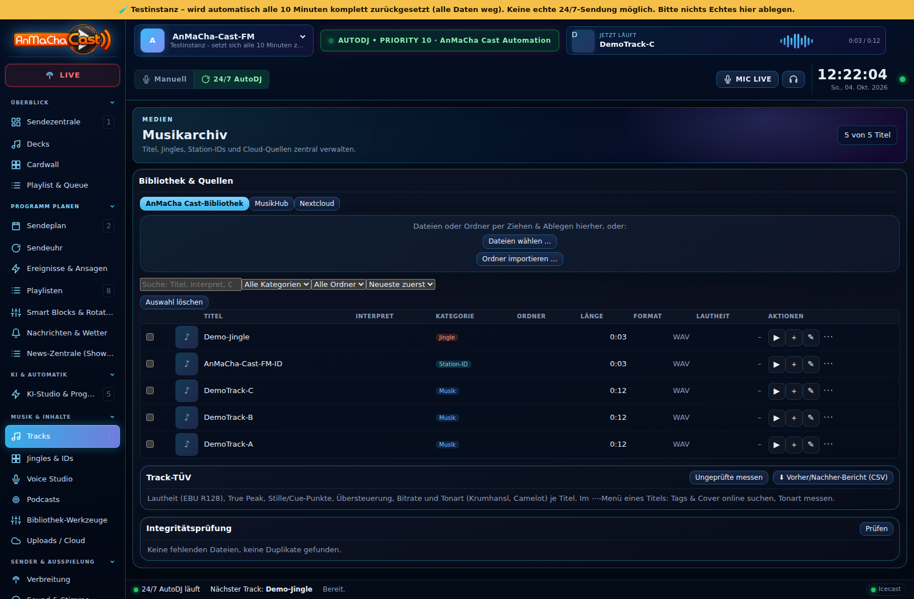
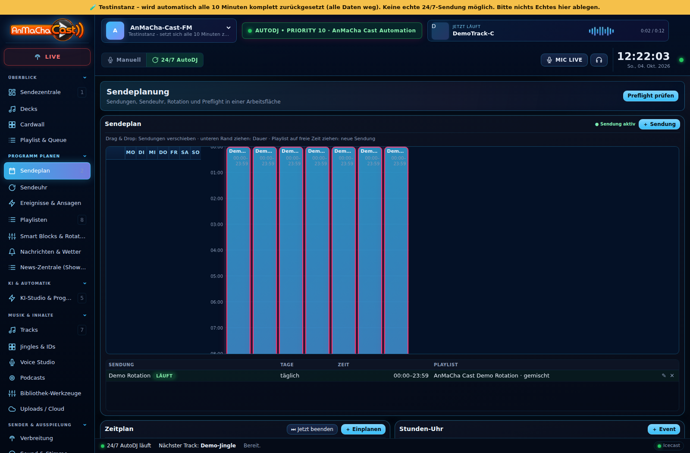
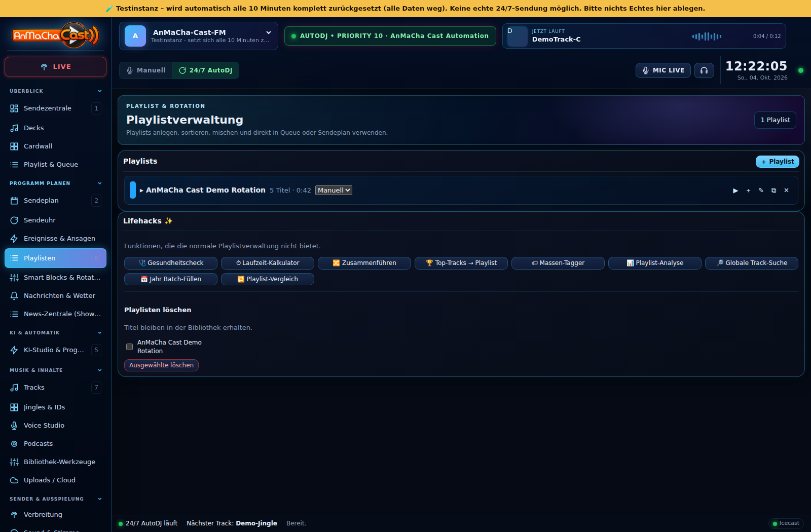
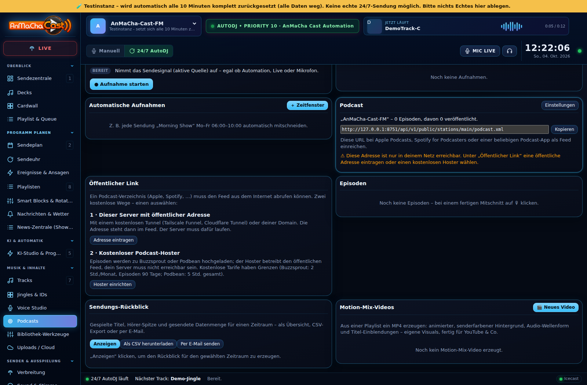
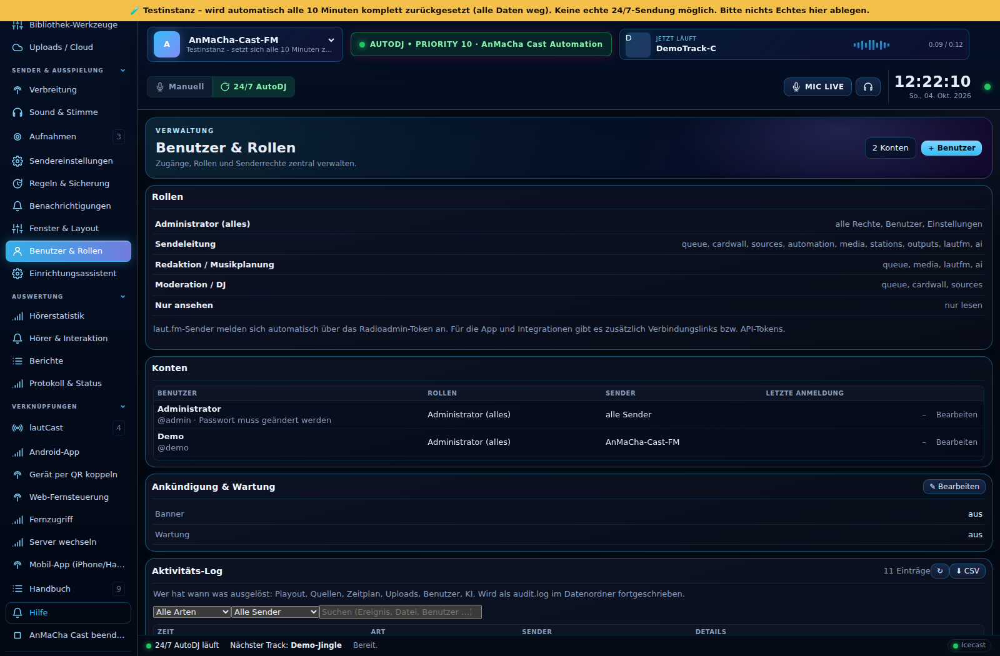
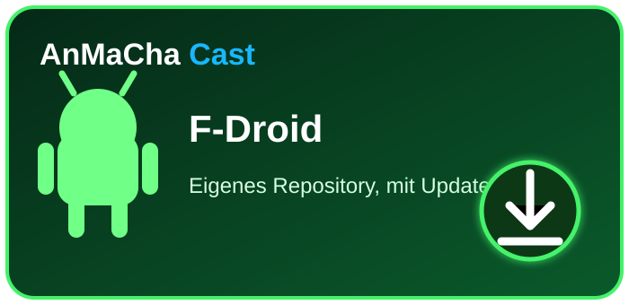

<h1 align="center">AnMaCha Cast</h1>
<h3 align="center">Dein Radio. Dein Studio. AnMaCha Cast.</h3>

Automation · Live Studio · Decks · Voice Studio · Podcast · Streaming · MusicHub · Apps · offene API

Automatisieren, live senden und mehrere Stationen verwalten – mit einer Oberfläche für den echten Radiobetrieb.

<a href="https://ricorewioriginal-collab.github.io/anmacha_cast/"><strong>🌐 AnMaCha-Cast-Projektseite</strong></a> · <a href="CHANGELOG.md"><strong>📝 Was ist neu?</strong></a> · <a href="https://ricorewioriginal-collab.github.io/anmacha_cast/app/"><strong>📱 Mobil-App (iPhone/Android im Browser)</strong></a>

<a href="#-anmacha-cast">Über AnMaCha Cast</a> · <a href="#-oberfläche--screenshots">Screenshots</a> · <a href="#-live-demo">Demo</a> · <a href="#️-anmacha-cast-herunterladen">Downloads</a> · <a href="#-versionshistorie--änderungen">Versionen</a> · <a href="#-projektstand">Projektstand</a> · <a href="#-entwickeln--mitwirken">Entwickeln</a> · <a href="#-dokumentation">Dokumentation</a> · <a href="#️-lizenz--kommerzielle-nutzung">Lizenz</a>

---

## 🎛️ AnMaCha Cast

AnMaCha Cast ist eine eigenständige Radio-Automation und Live-Broadcast-Plattform. Sie verbindet klassische Radioautomation mit einem modernen Studio, mehreren Sendern, Mediathek, Playlists, Sendeplanung, Streaming, Recorder, externen Providern und dem entstehenden senderübergreifenden **MusicHub**.

> **AnMaCha Cast ist für echte Radio-Workflows gedacht:** vom Live-Studio über automatisiertes Playout bis zur gemeinsamen Medienverwaltung mehrerer Stationen.

### ✨ Kernbereiche

| 🎚️ Studio & Playout | 🎵 Medien & Planung | 📡 Betrieb & Integration |
|---|---|---|
| Live Studio, Queue & Cardwall | Mediathek, Playlists, Smart-Blöcke & Sendeplanung | Streaming & externe Provider (laut.fm, Icecast …) |
| Vier Decks mit Wellenform, Loop und Tempo | Voice Studio: schneiden, entrauschen, aufbereiten | Zusatz-Streams & Ausspielwege |
| 24/7 Automation & Playout | MusicHub & Medienfreigaben | Benutzer, Rollen & Rechte, mehrere Sender |
| Recorder, Mitschnitte & Live-Steuerung | Nextcloud-/Storage-Anbindungen | **Offene REST-API** mit OpenAPI-Spezifikation |
| KI-Werkstatt: Texte, Sprache, Spots, Transkription | Nachrichten, Wetter & Sendungsvorbereitung | Windows, Android, Linux/Server & Docker |

### 📱 Apps

| App | Was sie kann |
|---|---|
| **Android** | **Go Live** (Push-to-Talk, Mikrofonquelle, vier Decks mit Titelzuordnung, laut.fm-Anmeldung, Nextcloud-Musikpool), **Studio** (Fernsteuerung des Servers) und **Sender-Admin** (laut.fm Radioadmin mobil: Playlists, Titel hochladen und verwalten, Sendeplan, Statistik, Benutzer, Automation) |
| **Windows** | Native Anwendung mit eingebauter Engine **oder** Verbindung zu entfernten Servern (Kopplungscode): Studio mit Decks und Warteschlange, Mediathek, Playlists, Planung & Aufnahme, Ausgänge & Quellen, Einstellungen, Podcast, Statistik, Hörer, KI, laut.fm, Server & Geräte und System – ohne Server nutzbar, Installer oder portabel |
| **Browser** | Das komplette Studio unter jeder Server-Adresse, auch als installierbare Web-App |

### 🎙️ Podcast mit echtem öffentlichem Link

Mitschnitte werden zu Episoden mit eigenem RSS-Feed. Damit Apple Podcasts, Spotify & Co. den Feed abrufen können, gibt es zwei kostenlose Wege:
eine **öffentliche Adresse** für den eigenen Server (z. B. per Tailscale Funnel oder Cloudflare Tunnel, mit Erreichbarkeitsprüfung) oder der
**Upload zu Buzzsprout bzw. Podbean**. Details: [docs/PODCAST_HOSTING.md](docs/PODCAST_HOSTING.md).

### 🔌 Offene API

Alles, was Studio und Apps können, steht auch per **REST-API** zur Verfügung – über 330 Endpunkte in 20 Bereichen, mit Rechten je Schlüssel.
Die [**API-Referenz**](docs/API-REFERENCE.md) und die [**OpenAPI-Spezifikation**](docs/openapi.json) werden aus dem Code erzeugt und von Tests geprüft;
auf jedem Server gibt es zusätzlich die interaktive Dokumentation unter `/api-docs.html` und die Spezifikation unter `/api/v1/openapi.json`.
Einstieg, Anmeldung, Rechte, App-Kopplung und Beispiele: [docs/API.md](docs/API.md) · [Interaktive API-Doku auf der Projektseite](https://ricorewioriginal-collab.github.io/anmacha_cast/api.html).

---

## 📸 Oberfläche & Screenshots

<strong>AnMaCha Cast in Bewegung</strong> Die Vorschau wird vom bestehenden Screenshot-Workflow aktualisiert. Für Details einfach ein Bild anklicken.

<table><tr><td align="center" width="33%"> <strong>🏠 Dashboard</strong></td><td align="center" width="33%"> <strong>🎚️ Studio</strong></td><td align="center" width="33%"> <strong>🎵 Mediathek</strong></td></tr></table>

<strong>🖼️ Weitere Screenshots anzeigen</strong>
 <table><tr><td align="center"> Sendeplanung</td><td align="center"> Playlists</td><td align="center"> Recorder</td></tr><tr><td align="center"> Nextcloud</td><td align="center"> Benutzer & Rechte</td><td align="center"> Mobile Ansicht</td></tr></table>

<a href="docs/screenshots/"><strong>Alle Screenshot-Dateien →</strong></a> · <a href="https://ricorewioriginal-collab.github.io/anmacha_cast/#screenshots"><strong>Interaktive Galerie →</strong></a>

---

## 🚀 Live-Demo

AnMaCha Cast kann direkt im Browser ausprobiert werden.

### 🔐 Öffentlicher Demo-Zugang

| | |
|---|---|
| **🌐 Live-Demo** | [anmachacast-demo.ricorewi-radio.de](https://anmachacast-demo.ricorewi-radio.de/demo-login.html) |
| **👤 Benutzername** | `demo` |
| **🔑 Passwort** | `anmachacast-demo` |

<a href="https://anmachacast-demo.ricorewi-radio.de/"><strong>▶ Demo jetzt öffnen</strong></a>

> **Hinweis:** Dieser Zugang ist ausschließlich für die öffentliche Testinstanz vorgesehen. Bitte keine produktiven, persönlichen oder vertraulichen Daten in der Demo hinterlegen.

---

## ⬇️ AnMaCha Cast herunterladen

<a href="CHANGELOG.md"><strong>📝 Changelog & Versionsvergleich</strong></a> · <a href="https://github.com/ricorewioriginal-collab/anmacha_cast/releases"><strong>📦 Alle Releases</strong></a>

<a href="https://ricorewioriginal-collab.github.io/anmacha_cast/ios.html"><strong>🍎 iPhone &amp; iPad: Mobil-App (PWA, ohne App Store)</strong></a>

> **F-Droid:** Die Android-App gibt es auch über ein eigenes F-Droid-Repository mit automatischen Updates: <https://ricorewioriginal-collab.github.io/anmacha_cast/fdroid/> (Adresse und Fingerabdruck stehen dort; funktioniert mit F-Droid, Droid-ify und Neo Store). Es ist nicht der offizielle F-Droid-Katalog. Die App ist mit demselben Schlüssel signiert wie die APK aus den Releases.

> Die Download-Links zeigen automatisch auf die Dateien des jeweils neuesten veröffentlichten GitHub-Releases (`AnMaCha-Cast-*`, siehe `docs/REBRANDING_ANMACHA_CAST.md` Phase 8). Ältere historische Releases können noch frühere Projektbezeichnungen oder Dateinamen enthalten; aktuelle Downloads und öffentliche Projektseiten verwenden ausschließlich AnMaCha Cast.

---

## 📝 Versionshistorie & Änderungen

AnMaCha Cast führt ein **automatisch gepflegtes Changelog**. Bei neuen offiziellen Veröffentlichungen werden Release, Datum und der Vergleich zur vorherigen Version ergänzt. So lässt sich nachvollziehen, was sich zwischen zwei veröffentlichten AnMaCha-Cast-Versionen geändert hat.

<a href="CHANGELOG.md"><strong>📝 Vollständigen Changelog öffnen →</strong></a> <a href="https://github.com/ricorewioriginal-collab/anmacha_cast/releases/latest"><strong>🚀 Aktuelle Release Notes öffnen →</strong></a>

---

## 📊 Projektstand

AnMaCha Cast befindet sich in aktiver Entwicklung. Funktionen, Oberfläche, Plattformpakete und Dokumentation werden laufend erweitert und getestet.

- **Status:** Beta
- **Build:** GitHub Actions
- **Release:** [immer die aktuelle veröffentlichte Version](https://github.com/ricorewioriginal-collab/anmacha_cast/releases/latest)
- **Änderungen:** [automatisch gepflegter Changelog](CHANGELOG.md)
- **Plattformen:** Windows · Android · Linux/Server · Docker
- **Live-Demo:** [anmachacast-demo.ricorewi-radio.de](https://anmachacast-demo.ricorewi-radio.de)

---

## 🧑‍💻 Entwickeln & Mitwirken

AnMaCha Cast kann von Entwicklern geklont und in einer eigenen Entwicklungsumgebung weiterentwickelt werden. Änderungen sollen nachvollziehbar, testbar und sicher bleiben. Vor einer offiziellen Übernahme oder Veröffentlichung werden Anpassungen geprüft und freigegeben.

Bitte vor Beiträgen **[CONTRIBUTING.md](CONTRIBUTING.md)** lesen. Für KI-unterstützte Entwicklung gelten zusätzlich die Hinweise in **[AI_HANDOVER.md](AI_HANDOVER.md)**: KI-generierte bzw. wesentlich KI-unterstützte Änderungen transparent kennzeichnen, Funktionen menschlich prüfen, Bugs beheben und Sicherheitslücken nicht ungeprüft übernehmen.

---

## 📚 Dokumentation

- **[AnMaCha-Cast-Projektdokumentation](https://ricorewioriginal-collab.github.io/anmacha_cast/docs.html)** – README, Changelog, Wiki und Lizenz direkt auf der Projektseite
- **[CHANGELOG.md](CHANGELOG.md)** – Versionshistorie und Vergleich veröffentlichter Versionen
- **[GitHub Wiki](https://github.com/ricorewioriginal-collab/anmacha_cast/wiki)** – ausführliche Projekt- und Entwicklerdokumentation
- **[API-Einstieg](docs/API.md)** · **[API-Referenz](docs/API-REFERENCE.md)** · **[OpenAPI](docs/openapi.json)** – REST-API für eigene Werkzeuge und Apps
- **[Podcast veröffentlichen](docs/PODCAST_HOSTING.md)** – öffentliche Adresse oder kostenloser Hoster
- **[Brücken & Webhooks](docs/BRIDGE.md)** – Icecast, AzuraCast, laut.fm
- **[Installation](docs/INSTALLATION.md)** – Installation und Plattformhinweise
- **[Docker](docs/DOCKER.md)** – Server-/Containerbetrieb
- **[CONTRIBUTING.md](CONTRIBUTING.md)** – Regeln für Beiträge und Freigaben
- **[AI_HANDOVER.md](AI_HANDOVER.md)** – Empfehlungen für KI-unterstützte Entwicklung

---

## ⚖️ Lizenz & kommerzielle Nutzung

Die normale AnMaCha-Cast-Version soll kostenlos nutzbar bleiben. Der Quellcode ist verfügbar, aber AnMaCha Cast ist **nicht als klassische Open-Source-Lizenz zur uneingeschränkten kommerziellen Weiterverwertung gedacht**. Maßgeblich sind ausschließlich die Bedingungen in **[LICENSE](LICENSE)**.

Wer AnMaCha Cast oder einen Fork kommerziell hosten, als kostenpflichtigen Dienst oder als eigenes Abomodell anbieten möchte, muss die dort beschriebenen Lizenzbedingungen beachten und gegebenenfalls eine kommerzielle Vereinbarung abschließen.

---

## 📻 AnMaCha Cast im Einsatz

AnMaCha Cast wird teilweise im Umfeld von **RicoReWi Radio / AnMaCha** eingesetzt. Musikstreams und weitere Radioprojekte findest du unter **[ricorewi-radio.de](https://www.ricorewi-radio.de/)**.

Für ausgewählte Streams wird **laut.fm** eingesetzt. laut.fm übernimmt im Rahmen seines Angebots für die dort betriebenen Sender die Abwicklung mit GEMA und GVL; für den konkreten Nutzungsfall gelten die jeweils aktuellen Bedingungen des Anbieters.

---

<strong>AnMaCha Cast</strong> Dein Radio. Dein Studio. AnMaCha Cast.

